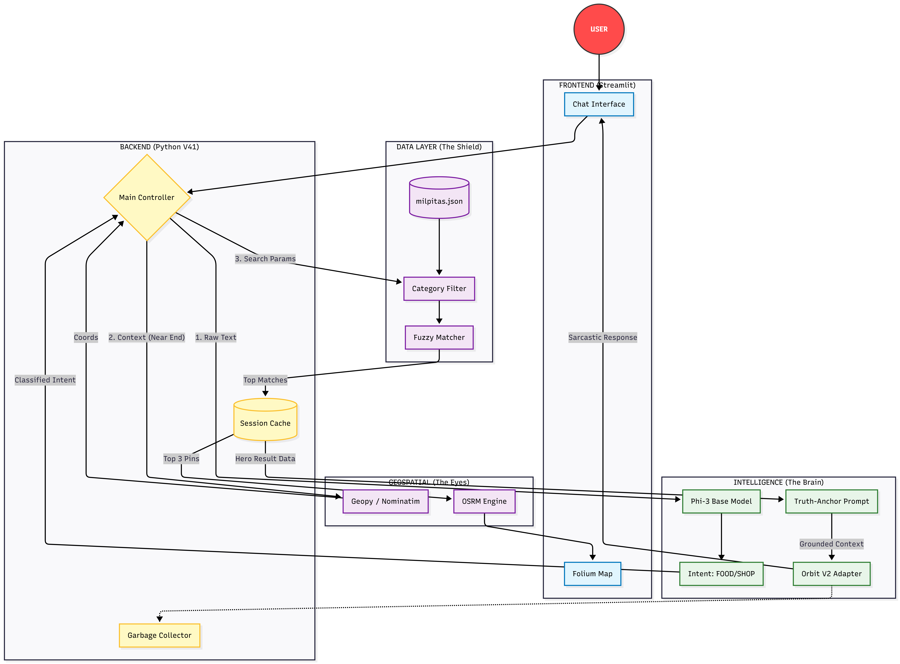

# Orbit: Context-Aware AI Navigator

Orbit is a local, voice-enabled navigation assistant built to explore the limits of Small Language Models (SLMs) on consumer hardware.

Unlike standard GPS systems which are purely functional, or generic AI assistants that often "hallucinate" fake addresses, Orbit uses a hybrid architecture. It combines a custom Fine-Tuned LLM (for personality) with a deterministic Python backend (for routing accuracy).

The goal of this project was to build an agent that is sarcastic, context-aware, and strictly grounded in truth, running entirely offline.

## System Architecture

I designed Orbit using a Neuro-Symbolic approach. I realized early on that LLMs are bad at math and geography, so I offloaded those tasks to Python.

The system separates "Reasoning" (AI) from "retrieval" (Python) to prevent logic errors.

## Key Engineering Challenges Solved

### 1. Stopping Hallucinations ("The Truth Anchor")
A major issue with generic models is that they invent addresses (e.g., "1234 Pizza Lane").
* **My Solution:** I implemented a strict retrieval-augmented workflow. The Python backend fetches the actual name, rating, and distance from the local database. This "Ground Truth" is injected into the prompt, forcing the AI to strictly style the response rather than inventing facts.

### 2. Intent Filtering ("The Shield")
Simple keyword searches failed when users asked complex queries like "Winter Jackets" (which matches "Jackets" but shouldn't show restaurants).
* **My Solution:** I use the base Phi-3 model as a classifier first. It categorizes the user's intent into FOOD, SHOP, or ACTIVITY. If the intent is SHOP, the system strictly blocks all restaurant categories from the search results before they even reach the ranking engine.

### 3. Contextual Spatial Awareness
Standard search is rigid. Orbit calculates relative positions:
* **"On the Way":** Calculates the geometric midpoint of the route to find stops that don't require major detours.
* **"Near Destination":** shifts the search radius to the endpoint rather than the user's current GPS.

## Tech Stack

* **AI Model:** Microsoft Phi-3 Mini (3.8B), quantized to 4-bit for memory efficiency.
* **Fine-Tuning:** Trained a custom LoRA (Low-Rank Adaptation) adapter on a cyberpunk/sarcastic dataset.
* **Backend:** Python 3.10+, Streamlit (UI), Folium (Maps).
* **Geospatial:** OSRM (Routing), Geopy (Geocoding), and fuzzy string matching for search.

## Project Structure

* 19_orbit_v25.py - The Main Application: Orchestrates the UI, AI inference, and Map logic.
* milpitas_final.json - Local Database: A cleaned dataset of places used to simulate a production vector DB.
* orbit_model_v2/ - The Adapter: [Not included in repo due to size] The custom weights that give Orbit its personality.
* requirements.txt - Dependencies required to run the environment.

## How to Run

1. Install Dependencies:
   pip install -r requirements.txt

2. Model Setup:
   This project requires the Phi-3 base model and my custom Orbit V2 LoRA adapter.
   Note: The adapter files are too large for GitHub. You would need to run the training script (train.py) locally to regenerate them.

3. Launch:
   streamlit run 19_orbit_v41.py

---
Created by Raja Prabakaran